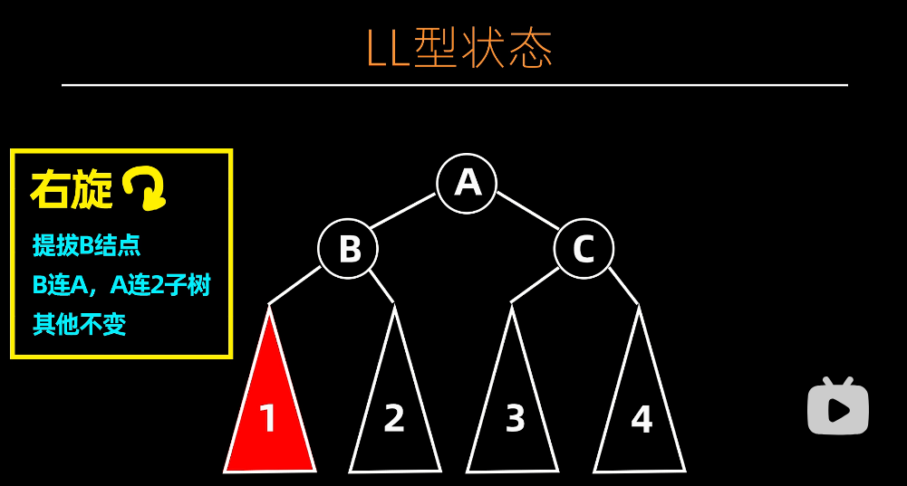
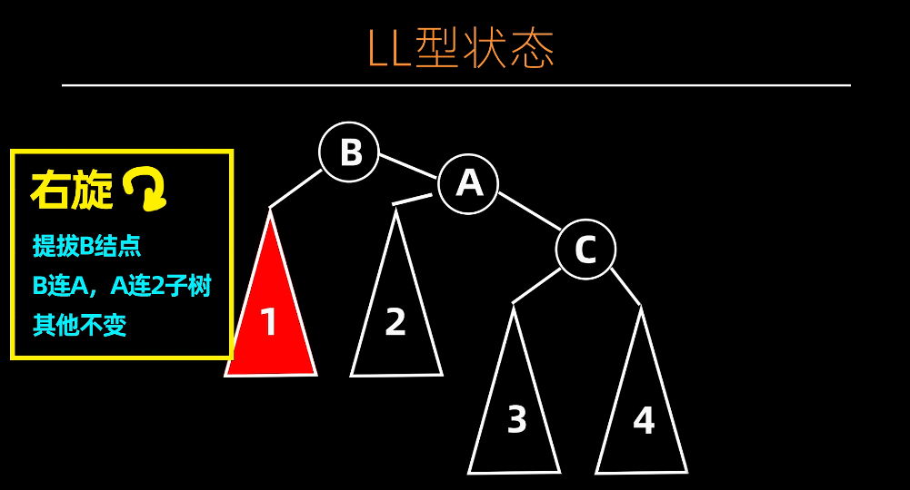
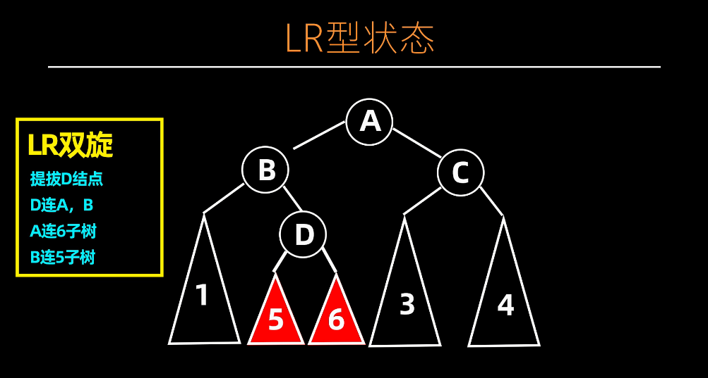
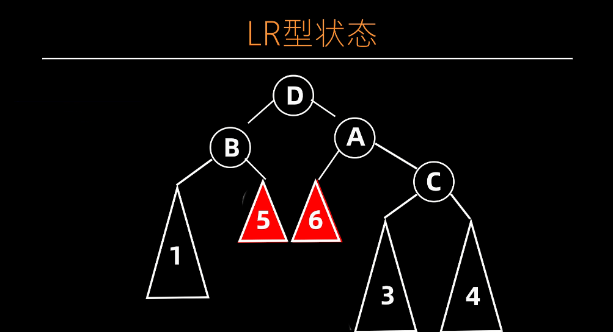
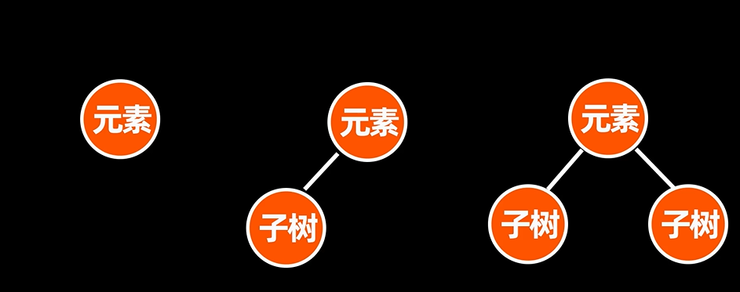

# AVL 树

## 插入和搜索操作

AVL 树的搜索操作与二叉搜索树基本一致。插入操作也与二叉搜索树一致，但是插入后还需要进行调整操作。

## AVL 树的调整

AVL 树在经过插入、删除某些节点后，会导致树的高度失衡。这时候需要对树进行调整。下面以 LL 和 LR 型两种状态进行举例说明。

至于 RR 和 RL 型状态，可以类比得出。

### LL 型

调整前


调整后


### LR 型

调整前


调整后


:::info

该操作实际上就是先对 B 左旋，再对 D 右旋。

:::

## AVL 树删除操作



如上图所示，被删除的节点有三种情况：叶子结点、有一颗子结点和两颗子结点。

- 如果是情况 1，直接移除该结点即可。然后调整 AVL 树至平衡。
- 如果是情况 2，令子节点取代父结点位置，原父结点删除，再调整至平衡即可。
- 如果是情况 3，令其中序后驱结点取代父结点，原父结点删除，再调整至平衡即可。

删除后，找到最高的子树进行调整即可。

## 编程实现

下面是使用 Python 语言实现 AVL 树的示例代码，包括插入、删除和搜索等基本操作：

```python
class AVLTreeNode:
    def __init__(self, key, height=1, left=None, right=None):
        # 节点初始化，包含键、高度、左子节点和右子节点
        self.key = key
        self.height = height
        self.left = left
        self.right = right

class AVLTree:
    def __init__(self):
        # AVL 树初始化，根节点设为 None
        self.root = None

    def get_height(self, node):
        # 获取节点的高度，如果节点为空返回 0
        if not node:
            return 0
        return node.height

    def get_balance(self, node):
        # 计算节点的平衡因子（左子树高度 - 右子树高度）
        if not node:
            return 0
        return self.get_height(node.left) - self.get_height(node.right)

    def update_height(self, node):
        # 更新节点的高度
        if node:
            node.height = 1 + max(self.get_height(node.left), self.get_height(node.right))

    def left_rotate(self, z):
        # 左旋转操作
        y = z.right
        T2 = y.left

        # 进行旋转
        y.left = z
        z.right = T2

        # 更新高度
        self.update_height(z)
        self.update_height(y)

        return y

    def right_rotate(self, z):
        # 右旋转操作
        y = z.left
        T3 = y.right

        # 进行旋转
        y.right = z
        z.left = T3

        # 更新高度
        self.update_height(z)
        self.update_height(y)

        return y

    def insert(self, node, key):
        # 插入节点并保持 AVL 树平衡
        if not node:
            return AVLTreeNode(key)
        elif key < node.key:
            node.left = self.insert(node.left, key)
        else:
            node.right = self.insert(node.right, key)

        # 更新高度和计算平衡因子
        self.update_height(node)
        balance = self.get_balance(node)

        # 左左情况
        if balance > 1 and key < node.left.key:
            return self.right_rotate(node)
        # 右右情况
        if balance < -1 and key > node.right.key:
            return self.left_rotate(node)
        # 左右情况
        if balance > 1 and key > node.left.key:
            node.left = self.left_rotate(node.left)
            return self.right_rotate(node)
        # 右左情况
        if balance < -1 and key < node.right.key:
            node.right = self.right_rotate(node.right)
            return self.left_rotate(node)

        return node

    def delete(self, node, key):
        # 删除节点并保持 AVL 树平衡
        if not node:
            return node
        elif key < node.key:
            node.left = self.delete(node.left, key)
        elif key > node.key:
            node.right = self.delete(node.right, key)
        else:
            # 处理删除的三种情况：无子节点、一个子节点、两个子节点
            if not node.left:
                return node.right
            elif not node.right:
                return node.left

            # 用右子树中的最小节点替换要删除的节点
            temp = self.get_min_value_node(node.right)
            node.key = temp.key
            node.right = self.delete(node.right, temp.key)

        # 如果树变空，直接返回
        if not node:
            return node

        # 更新高度和计算平衡因子
        self.update_height(node)
        balance = self.get_balance(node)

        # 左左情况
        if balance > 1 and self.get_balance(node.left) >= 0:
            return self.right_rotate(node)
        # 左右情况
        if balance > 1 and self.get_balance(node.left) < 0:
            node.left = self.left_rotate(node.left)
            return self.right_rotate(node)
        # 右右情况
        if balance < -1 and self.get_balance(node.right) <= 0:
            return self.left_rotate(node)
        # 右左情况
        if balance < -1 and self.get_balance(node.right) > 0:
            node.right = self.right_rotate(node.right)
            return self.left_rotate(node)

        return node

    def get_min_value_node(self, node):
        # 获取以指定节点为根的子树中的最小值节点
        if node is None or node.left is None:
            return node
        return self.get_min_value_node(node.left)

    def pre_order(self, node):
        # 前序遍历并打印节点
        if not node:
            return
        print(f"{node.key} ", end="")
        self.pre_order(node.left)
        self.pre_order(node.right)

    def insert_key(self, key):
        # 外部插入接口
        self.root = self.insert(self.root, key)

    def delete_key(self, key):
        # 外部删除接口
        self.root = self.delete(self.root, key)
```

## 参考视频

<iframe src="//player.bilibili.com/player.html?aid=771038005&bvid=BV1dr4y1j7Mz&cid=776606625&p=1" scrolling="no" width="100%" height="500" border="0" frameborder="no" framespacing="0" allowfullscreen="true"> </iframe>

<iframe src="//player.bilibili.com/player.html?aid=258662669&bvid=BV15a411D7tr&cid=779100775&p=1" scrolling="no" width="100%" height="500" border="0" frameborder="no" framespacing="0" allowfullscreen="true"> </iframe>
